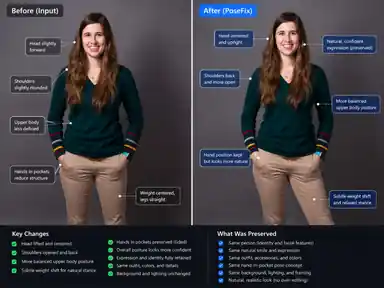
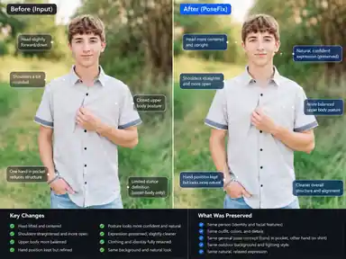

# PoseFix Visual Showcase

These examples illustrate the visual goal of PoseFix: **change the pose while preserving the photograph**.

They are exploratory visual demonstrations created during product validation. They are **not benchmark claims or evidence that the current live-provider pipeline produced these exact outputs end-to-end**.

## Full-body scene-contact example

This example explores a more complex full-body correction while preserving the original person, outfit, outdoor setting, expression, and fence interaction.

## Studio standing example

This example focuses on a centered standing pose with both hands already serving a useful purpose. The intended correction is subtle: improve stance, shoulder openness, and overall balance without unnecessarily replacing the hand pose.

## Upper-body example

This example shows a smaller edit surface. With the lower body outside the frame, the useful corrections are mostly head position, shoulder openness, torso balance, and arm geometry.

## What these examples are for

The showcase is useful for communicating the product target:

- preserve identity and expression;
- preserve clothing, lighting, background, and photographic character;
- change only the pose mechanics that need improvement;
- keep successful parts of the original pose as anchors;
- prefer natural-looking corrections over wholesale re-posing.

PoseFix V1 remains intentionally scoped to **single-person existing-photo pose correction**. Multi-person work is being treated as experimental edge-case research rather than supported V1 behavior.
